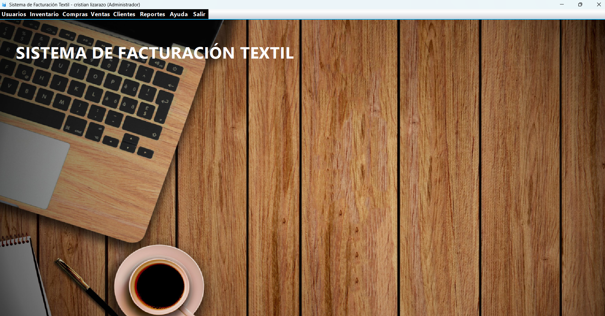

# AdminTextil - Sistema de Facturación Textil

**Proyecto del Taller de Panel Administrativo**  
Tecnología de Desarrollos de Sistemas Informáticos  
📅 I Semestre 2026  
👨‍🏫 Profesor: Mag. Carlos Adolfo Beltrán Castro  
👨‍💻 Estudiante: Cristian Andres Lizarazo Ovalle

---

## 🚀 Descripción del Proyecto

Este proyecto simula un sistema de facturación para una empresa textil, desarrollado con **Java SE** y **Swing**. Incluye navegación entre diferentes módulos del panel administrativo y la funcionalidad de CRUD para **Usuarios**, **Productos**, **Clientes**, **Proveedores**, **Ventas** y **Compras**, todos conectados a una base de datos **SQLite**.

El sistema gestiona usuarios con roles de **Administrador**, **Vendedor** y **Cliente**, además de permitir el control de inventario, transferencias entre bodega y tienda, reportes HTML y gráficas de ventas.

---

## 📸 Vista general del sistema



---

## 📂 Estructura del Proyecto

```text
AdminTextil/
├── database/
│   ├── script.sql              # Script SQL de creación de tablas y datos
│   ├── diagrama-er.md          # Diagrama Entidad-Relación en Markdown
│   └── diagrama-er.svg         # Versión gráfica del modelo ER
├── src/main/java/
│   ├── com/textil/admintextil/ # Clase principal del proyecto
│   ├── conexion/               # Conexión a SQLite
│   ├── util/                   # Utilidades: migraciones, sesión, inventario
│   └── vistas/                 # Formularios Swing (CRUD, reportes, ventas)
├── src/test/java/              # Pruebas unitarias básicas
├── pom.xml
└── README.md
```

### Menú principal del sistema

| Menú | Opciones principales |
|------|-----------------------|
| **Usuarios** | Registrar Usuario, Administrar Usuarios |
| **Inventario** | Productos, Catálogo Productos, Proveedores, Transferencias |
| **Compras** | Orden de Compra, Gestionar Compras |
| **Ventas** | Orden de Venta, Gestionar Ventas |
| **Clientes** | Registrar Cliente |
| **Reportes** | Reporte Clientes, Productos, Ventas, Compras, Stock Bajo, Gráficas |
| **Ayuda** | Acerca del Sistema, Manual |
| **Salir** | Cerrar Sesión |

### Vistas CRUD disponibles

| Módulo | Formulario | Operaciones |
|--------|------------|-------------|
| Usuarios | FrmUsuarios, FrmAdministrarUsuarios | Crear, Leer, Actualizar, Eliminar |
| Productos | FrmProductos | Crear, Leer, Actualizar, Eliminar |
| Clientes | FrmClientes | Crear, Leer, Actualizar, Eliminar |
| Proveedores | FrmProveedores | Crear, Leer, Actualizar, Eliminar |
| Ventas | FrmVentas, FrmGestionarVentas | Crear, Leer, Actualizar/Anular |
| Compras | FrmOrdenCompra, FrmGestionarCompras | Crear, Leer, Actualizar/Anular |
| Transferencias | FrmTransferencias | Registrar movimientos de stock |

---

## 🛒 Flujo de uso de la venta

1. Buscar un producto en el campo de búsqueda.
2. Seleccionar el producto desde la tabla.
3. Ingresar la cantidad deseada.
4. Agregar el producto a la venta.
5. Guardar la venta con los datos del cliente y el pago recibido.

---

## 🧰 Tecnologías usadas

| Tecnología | Uso |
|------------|-----|
| Java SE 17 | Lenguaje principal |
| Java Swing | Interfaz gráfica de escritorio |
| SQLite | Base de datos embebida |
| Maven | Gestión de dependencias y compilación |
| sqlite-jdbc 3.45.1.0 | Driver JDBC para SQLite |
| jBCrypt 0.4 | Encriptación de contraseñas |
| NetBeans Form Editor | Diseño visual de formularios |

---

## 🗄️ Base de Datos

### Configuración automática

Al iniciar la aplicación, el sistema:

1. Crea el archivo textil.db si no existe.
2. Ejecuta las migraciones automáticas desde DatabaseMigrator.
3. Inserta datos de ejemplo como usuarios, productos, clientes y proveedores.

### Archivos importantes

- Script SQL: [database/script.sql](database/script.sql)
- Diagrama entidad-relación:

[alt text](entidad-relacion.png)imagen del diagrama entidad-relación]

### Usuarios por defecto

| Usuario | Contraseña | Rol |
|---------|------------|-----|
| admin | admin123 | Administrador |
| vendedor | vendedor123 | Vendedor |
| cliente | cliente123 | Cliente |

---

## 🔧 Instalación y ejecución

### Requisitos previos

- JDK 17 o superior
- Maven 3.8+

### Pasos

1. Clonar o descargar el repositorio.
2. Abrir la carpeta AdminTextil en NetBeans o en tu IDE favorito.
3. Compilar con Maven:

```bash
cd AdminTextil
mvn clean compile
```

4. Ejecutar la aplicación:

```bash
mvn exec:java
```

5. Iniciar sesión con las credenciales anteriores.
6. La base de datos textil.db se generará automáticamente.

### Generar JAR ejecutable

```bash
mvn clean package
java -jar target/AdminTextil-1.0-SNAPSHOT.jar
```

---

## 🔐 Roles y permisos

| Rol | Acceso |
|-----|--------|
| Administrador | Acceso completo a todos los módulos |
| Vendedor | Catálogo, ventas, clientes, reportes y gráficas |
| Cliente | Solo catálogo de productos y ayuda |

---

## 📋 Entregables del taller

- [x] Script SQL de la base de datos
- [x] Diagrama Entidad-Relación
- [x] Proyecto completo con menú de navegación
- [x] Conexión a base de datos SQLite
- [x] CRUD por grupo funcional con acceso a la base de datos
- [x] Documento resumen (README)

---

## 👤 Autor

**Cristian Andres Lizarazo Ovalle**
I Semestre 2026 — Taller de Panel Administrativo
