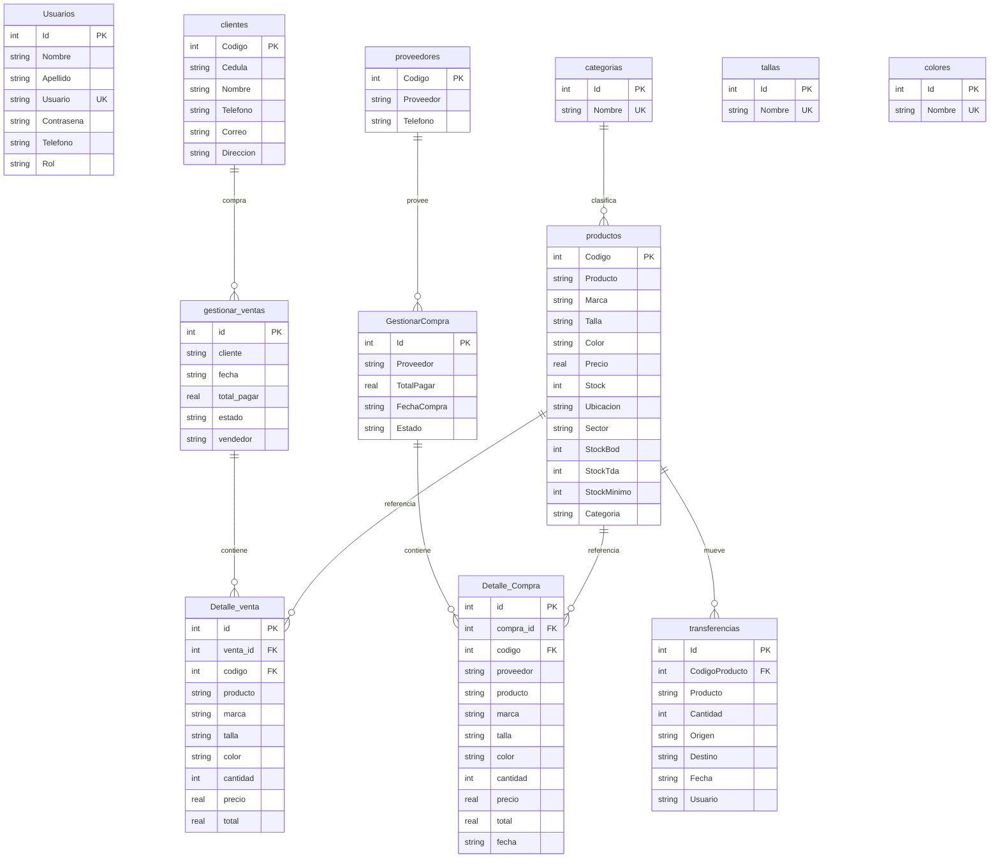

# Diagrama Entidad-Relación - AdminTextil

## Diagrama ER

## Relaciones principales

| Relación | Descripción |
|----------|-------------|
| `gestionar_ventas` → `Detalle_venta` | Una venta tiene uno o más productos vendidos |
| `GestionarCompra` → `Detalle_Compra` | Una compra tiene uno o más productos adquiridos |
| `productos` → `Detalle_venta` | Cada línea de venta referencia un producto por código |
| `productos` → `Detalle_Compra` | Cada línea de compra referencia un producto por código |
| `productos` → `transferencias` | Registra movimientos de stock entre bodega y tienda |
| `clientes` → `gestionar_ventas` | El nombre del cliente se almacena en la cabecera de venta |
| `proveedores` → `GestionarCompra` | El proveedor se almacena en la cabecera de compra |
