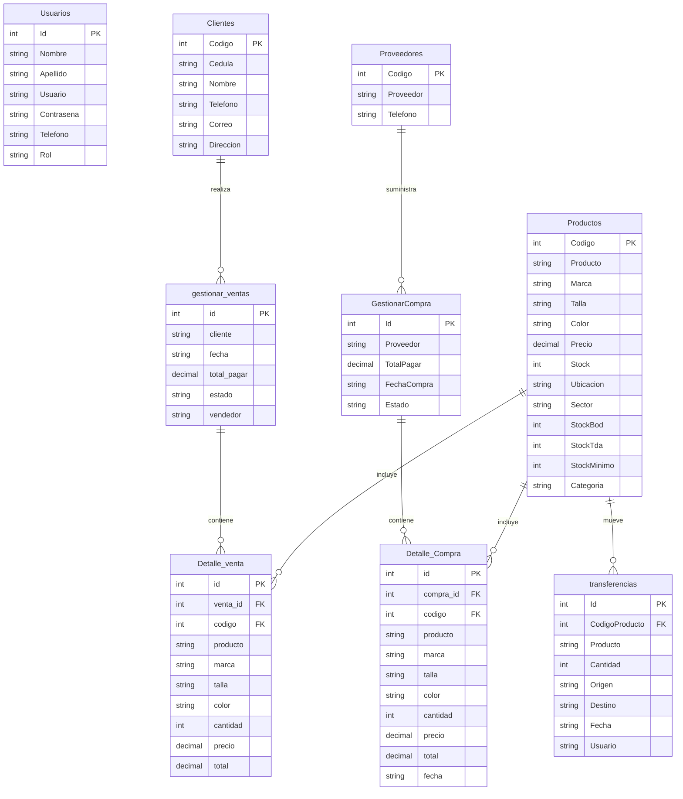

# Documento de Entidad Relación - AdminTextil

## 1. Introducción
Este documento presenta el modelo entidad-relación de la base de datos del sistema AdminTextil. El objetivo es organizar la información de usuarios, productos, clientes, proveedores, ventas, compras y transferencias de forma lógica y estructurada.

## 2. Entidades principales

### Usuarios
Atributos:
- Id (PK)
- Nombre
- Apellido
- Usuario
- Contraseña
- Telefono
- Rol

### Productos
Atributos:
- Codigo (PK)
- Producto
- Marca
- Talla
- Color
- Precio
- Stock
- Ubicacion
- Sector
- StockBod
- StockTda
- StockMinimo
- Categoria

### Clientes
Atributos:
- Codigo (PK)
- Cedula
- Nombre
- Telefono
- Correo
- Direccion

### Proveedores
Atributos:
- Codigo (PK)
- Proveedor
- Telefono

### GestionarCompra
Atributos:
- Id (PK)
- Proveedor
- TotalPagar
- FechaCompra
- Estado

### Detalle_Compra
Atributos:
- id (PK)
- compra_id (FK)
- codigo (FK)
- proveedor
- producto
- marca
- talla
- color
- cantidad
- precio
- total
- fecha

### gestionar_ventas
Atributos:
- id (PK)
- cliente
- fecha
- total_pagar
- estado
- vendedor

### Detalle_venta
Atributos:
- id (PK)
- venta_id (FK)
- codigo (FK)
- producto
- marca
- talla
- color
- cantidad
- precio
- total

### transferencias
Atributos:
- Id (PK)
- CodigoProducto (FK)
- Producto
- Cantidad
- Origen
- Destino
- Fecha
- Usuario

## 3. Relaciones principales
- Un cliente puede tener muchas ventas.
- Una venta puede tener muchos detalles de venta.
- Un producto puede aparecer en muchas ventas y compras.
- Una compra puede tener muchos detalles de compra.
- Un proveedor puede tener muchas compras.
- Un producto puede tener muchas transferencias de inventario.

## 4. Diagrama entidad-relación

## 5. Conclusión
Este modelo permite representar de forma clara las relaciones del sistema de facturación textil y facilita la gestión de los procesos de ventas, compras, inventario y usuarios.
